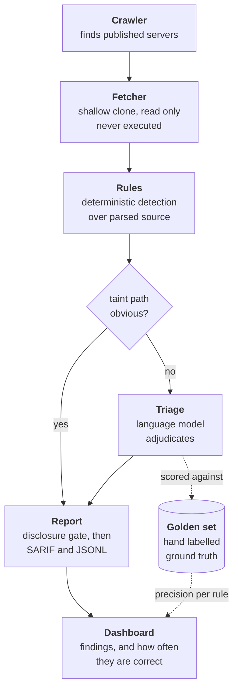

# MCP Security Observatory

A public risk index for the Model Context Protocol server ecosystem, published
with an honest measure of how often it is right.

> **Status: pre-launch.** The analyzer is being built in the open. No
> ecosystem-wide numbers are published yet, and this README will not claim any
> until they are.

## The problem

AI assistants like Claude Code and Cursor extend themselves by loading plugins
called MCP servers. Close to ten thousand have been published. They run on a
developer's own machine, with that developer's own privileges, and in most
editors they start automatically when a project is opened. There is no sandbox
and no review.

A plugin describes its own tools in plain English, and the assistant acts on
those descriptions. That turns the description into an instruction channel
pointed straight at the model. Text hidden inside it can tell the assistant to
do something the developer never asked for, and the developer never sees it.

Published research found critical flaws in roughly a third of the servers it
examined, and path traversal bugs in 82% of the ones that touch files. Checking
a plugin means reading the source of untrusted software, software you must
never run in order to inspect it.

## What this does

It reads published MCP servers without executing a single line of them.

Five rules look for the specific ways these plugins go wrong: characters hidden
from human eyes, instructions smuggled into tool descriptions, unchecked file
paths, unsafe shell commands, and permissions far wider than the plugin needs.

Clear cut cases are decided by code alone. The genuinely ambiguous ones go to a
language model, and every one of those judgements is scored against a hand
labelled answer key.

The result is a continuously updated public index, published with its own
accuracy beside it. If the tool is wrong fifteen percent of the time, the
dashboard says fifteen percent. Serious findings go privately to maintainers
first, and a maintainer who asks to be excluded is excluded.

## What is different about this one

Other MCP scanners exist, and some are good. They will read a server you point
them at and tell you what looks wrong. Three things are missing from the field.

**Accuracy measured on a random sample.** Where scanners report accuracy at all,
it is usually measured against a set of examples the authors chose themselves,
which mostly shows whether the rules match the cases they were written from. The
golden set here is sampled at random from real findings across the whole scanned
corpus, and the sampling method is published next to the numbers. Expect a figure
well below perfect. That is the point: a scanner whose error rate nobody knows is
an opinion, and a perfect score is usually a sign that the measurement was
circular.

**A trend over time.** Existing tools give a snapshot. Nobody can currently
answer whether this ecosystem is getting safer or worse. This runs nightly and
keeps the history, so the question becomes answerable.

**Disclosure before publication.** Serious findings are withheld for ninety days
and sent privately to the maintainer first, enforced in code rather than promised
in a policy document. Scanning someone's project and publishing the result
carries an obligation, and that obligation should be executable.

The labeled corpus itself is published as an open benchmark with a scoring
script, so any scanner can be measured on the same footing rather than each
quoting a number from its own private collection. A result showing the ecosystem
is healthier than reported is just as publishable as an alarming one.

## How it works



Each stage writes a file, so any stage can be run, tested and replaced on its
own. The scoring loop on the right is what produces the published accuracy
figure, and it gates every pull request.

## Running it

Requires Python 3.11 or newer.

```bash
python3.12 -m venv .venv && source .venv/bin/activate
pip install -e ".[dev]"
```

Scan a single public server:

```bash
mcp-observatory --repo-url https://github.com/owner/repo --server-id owner/repo
```

Scan a whole index of servers:

```bash
mcp-observatory --index data/server_index.jsonl
```

Output is JSON on stdout. A full run writes `data/findings.jsonl` and
`data/findings.sarif`, and the SARIF file uploads directly to GitHub code
scanning.

```bash
pytest -v        # test suite
ruff check .     # lint
```

## Repository layout

| Path | Purpose |
|---|---|
| `analyzer/crawler/` | Discovers servers from the official registry and GitHub |
| `analyzer/fetcher/` | Shallow-clones a server at a pinned commit, read only |
| `analyzer/rules/` | Deterministic detection rules, tree-sitter based |
| `analyzer/triage/` | Model adjudication of ambiguous findings, content-hash cached |
| `analyzer/report/` | Disclosure gate, SARIF and JSONL output |
| `evals/golden/` | Hand-labelled findings used to measure the triage layer |
| `evals/harness/` | Precision, recall and F1 measurement, runs in CI |
| `fixtures/` | Deliberately vulnerable and known-clean servers for rule tests |
| `data/` | Committed scan artifacts. Git history provides the time series |
| `web/` | Static dashboard |

## Coverage in v1

`UNICODE-CONCEAL` runs against every server, because it needs no parser. The
four deeper rules cover Python servers in v1. Results always state which, and a
figure derived from Python servers is never presented as an ecosystem-wide one.
TypeScript support is the first work after v1. See `DECISIONS.md` D6.

## Principles

- **Never execute a scanned server.** The fetcher may invoke `git` and nothing
  else. A test enforces this, not a convention.
- **Publish the error rate.** Per-rule precision ships next to the findings.
- **Disclose before publishing.** Serious findings are withheld pending a
  private disclosure window, enforced in code.
- **No exploit code, ever.**

See [`SECURITY.md`](SECURITY.md) for the disclosure policy,
[`DECISIONS.md`](DECISIONS.md) for the engineering log, and
[`docs/specs/`](docs/specs/) for the design.
