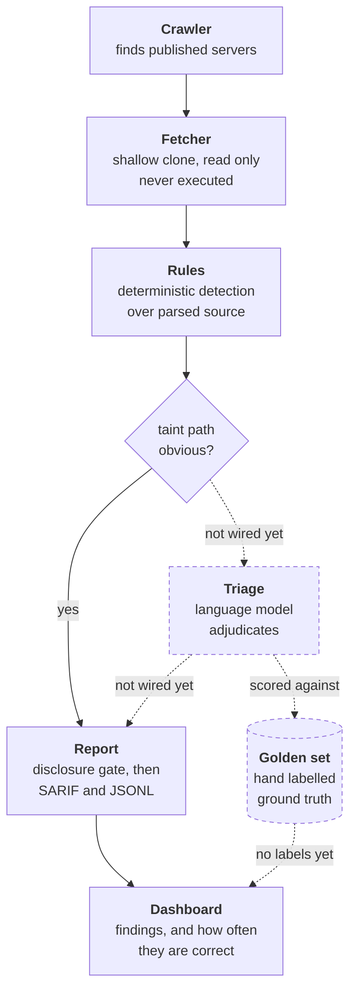

# MCP Security Observatory


**A public risk index for MCP servers, built so that its own error rate can be
measured and published beside it.**

### → [manankumarthakkar.github.io/mcp-observatory](https://manankumarthakkar.github.io/mcp-observatory/)

AI assistants load plugins called MCP servers. They run on your machine, with
your privileges, and most editors start them automatically when you open a
project. There is no sandbox and no review. This reads them without running a
single line of them.

> **What is live, stated precisely.** 1,643 servers scanned from a reproducible
> sample of a 21,492-repository corpus. 1,296 findings, of which 323 are
> published and 973 are withheld pending disclosure. **Accuracy has not been
> measured yet:** 288 findings are drawn and captured for hand-labelling and none
> are labelled, so every published finding is a candidate rather than a confirmed
> problem. [What is not built yet](#-what-is-not-built-yet) lists the rest.

---

## Contents

- [🧭 Who this is for](#-who-this-is-for)
- [🎯 The problem](#-the-problem)
- [🔍 What this does](#-what-this-does)
- [📊 What has actually been measured](#-what-has-actually-been-measured)
- [⭐ What is different about this one](#-what-is-different-about-this-one)
- [🏗️ How it works](#-how-it-works)
- [⚡ Running it](#-running-it)
- [🚧 What is not built yet](#-what-is-not-built-yet)
- [🗺️ Where it stands](#-where-it-stands)
- [📁 Repository layout](#-repository-layout)
- [🛡️ Principles](#-principles)

---

## 🧭 Who this is for

| You are | What you get |
| --- | --- |
| **A developer installing MCP servers** | A way to check whether a plugin you are about to give filesystem and shell access is safe, and how much to trust that answer. |
| **An MCP server maintainer** | A page for your own server, and a policy that withholds every high and critical finding until you have been notified. *Notification is not built yet, which is why nothing above medium is published at all.* |
| **A security researcher** | A scoring script, a published sampling method, and 288 findings drawn at random and captured for labelling. *The labels do not exist yet, so the benchmark is a method and a corpus, not yet an answer key.* |
| **Anyone curious how this is built** | An engineering log of every decision and what it cost, and a methodology page where every published number shows its working. |

You do **not** need to know what MCP is to read the next section.

---

## 🎯 The problem

A plugin describes its own tools in plain English, and the assistant acts on
those descriptions. That turns a description into an instruction channel
pointed straight at the model. Text hidden inside it can tell the assistant to
do something you never asked for, and you never see it.

Published research found critical flaws in roughly a third of the servers it
examined, and path-traversal bugs in 82% of those that touch files.

Checking a plugin means reading the source of untrusted software — software you
must **never run** in order to inspect it.

And the ecosystem is bigger than anyone says. Published counts disagree by a
factor of eight, because a registry entry is a *registered name*, not a server.
A crawl on 2026-09-23 found:

```
35,009  registry entries
 8,117  no source to read       (hosted services)
 5,400  duplicates of a repository already counted
21,492  distinct repositories   <- the corpus
 1,643  scanned so far          (a reproducible 2,000-repo sample, seed 20260923)
```

One account alone holds **2,332 registered names pointing at a single
repository**. And a search of GitHub found **13,291 more servers registered
nowhere at all**.

<sub>Full working: [docs/methodology.md](docs/methodology.md) · regenerated
counts: [docs/coverage.md](docs/coverage.md)</sub>

---

## 🔍 What this does

It reads published MCP servers **without executing a single line of them**.

Five rules look for the specific ways these plugins go wrong:

| Rule | Looks for | Built |
| --- | --- | :---: |
| `UNICODE-CONCEAL` | Characters hidden from human eyes | ✅ |
| `SHELL-EXEC-UNSAFE` | Tool input reaching a command interpreter | ✅ |
| `PATH-TRAVERSAL` | Tool input reaching the filesystem unchecked | ✅ |
| `TOOL-DESC-INJECTION` | Instructions smuggled into tool descriptions | ✅ |
| `SCOPE-OVERBROAD` | Permissions far wider than the plugin needs | ✅ |

Clear-cut cases are decided by code alone and never cost anything. The
genuinely ambiguous ones go to a judgement model, and **every one of those
judgements is scored against a hand-labelled answer key.**

Anything a plugin ships that its users never run — tests, build scripts,
examples — is not scanned at all, because a flaw there is not a flaw an
assistant can reach. That single decision removed nearly half the findings on a
trial run.

> **Which servers get which checks.** The hidden-character rule reads every
> server, because it needs no parser. The deeper rules read code, and today
> they cover **TypeScript and JavaScript** — measured at 50% of both the
> registry and the unregistered population, against Python's 26–38%. Python
> servers get the character check now and the deeper rules next. **A figure
> from one language is never presented as an ecosystem-wide one.**

---

## 📊 What has actually been measured

A pilot on 2026-09-22: **43 real findings from 10 real servers**, each labelled
by hand by reading the code.

| | precision | recall |
| --- | ---: | ---: |
| Every finding the rules report | **0.81** | **1.00** |
| Only findings the rules call high confidence | 0.62 | 0.14 |
| A calibrated judgement above 0.5 | 0.89 | 0.94 |

**This is a pilot, not the accuracy figure this project exists to publish, and
you cannot reproduce it from this repository.** Three limits, the third of which
is the worst:

1. The sample is concentrated: 22 of 43 findings come from one repository.
2. The same project wrote both the rules and the labels, which is exactly the
   weakness we criticise in figures published elsewhere.
3. **The 43 labels were not retained.** The pilot predates the golden-set
   machinery, and its judgements existed only in the session that made them. The
   figure is therefore indicative and unverifiable, which by this project's own
   standard makes it worth less than it looks.

That third limit is why the current pipeline captures each finding's source
window to a file, assigns stable ids, writes after every keystroke and preserves
labels across a re-draw. A measurement whose inputs are not kept is a story about
a measurement.

**The most useful result was about us.** Our own "high confidence" flag scored
*worse* than reporting everything. It means "the taint path is unambiguous",
which turns out not to predict whether anything is exploitable. That assumption
shaped two rules and survived only because nothing had ever scored it.

<sub>Method, caveats and what changed as a result:
[docs/methodology.md](docs/methodology.md)</sub>

---

## ⭐ What is different about this one

Other MCP scanners exist, and some are good. Four things are missing from the
field.

**📐 Accuracy measured on a random sample.** Where scanners report accuracy at
all, it is usually against examples the authors chose themselves — which mostly
shows whether the rules match the cases they were written from. Expect a figure
well below perfect here. A perfect score is usually a sign the measurement was
circular.

**📈 A trend over time.** Existing tools give a snapshot. Nobody can currently
answer whether this ecosystem is getting safer. The series is designed to be one
appended point per night and the scheduled job is written but not yet merged, so
**there is one point so far.** A trend needs time and cannot be backfilled.

**🔒 Disclosure before publication.** Every high and critical finding is
withheld by a gate in `analyzer/report/`, enforced in code rather than promised
in a document — a finding cannot reach `data/` in a publishable state without
passing it. **The notification half is not built.** Since a window opens only
when a notification is recorded, nothing above medium has ever been published,
which is the gate failing closed.

**💰 A published cost per server.** Most checks never call a model. "It's
cheap" is an adjective; a number you can check is not.

The labelled corpus is intended to ship as an **open benchmark with a scoring
script**, so any scanner can be measured on the same footing rather than quoting
a number from its own private collection. The script and the sampling method
exist; the labels do not. A result showing the ecosystem is healthier than
reported is just as publishable as an alarming one.

---

## 🏗️ How it works



Solid edges are paths a scan takes today. Dashed edges and dashed boxes are
built and tested in isolation but not yet connected: every finding currently
reaches the report from the rules alone.

Each stage writes a file, so any stage can be run, tested and replaced on its
own.

**Two parts of this diagram are not wired yet, and the diagram marks them
dashed.** Triage is built and tested but the pipeline does not call it, so today
every finding reaches the report from the rules alone. The scoring loop is
built and does not gate pull requests, because it has no labels to score
against. CI runs the test suite, ruff and mypy on every pull request; it does
not yet check accuracy.

---

## ⚡ Running it

**Requires Python 3.11+.**

```bash
python3.12 -m venv .venv && source .venv/bin/activate
pip install -e ".[dev]"
```

**Scan one server:**

```bash
mcp-observatory scan --repo-url https://github.com/owner/repo --server-id owner/repo
```

**See what there is to scan** (~90 seconds, no token needed, so anyone can
reproduce the published figure):

```bash
mcp-observatory crawl
```

**Also find servers registered nowhere** (~20 minutes; code search allows ten
requests a minute):

```bash
GITHUB_TOKEN=... mcp-observatory crawl --with-code-search
```

The token is read from the environment rather than a flag, so it stays out of
your shell history.

**Run the whole thing.** The crawl writes the index, one entry per
repository; the scan reads it and publishes what may be published:

```bash
mcp-observatory crawl
mcp-observatory scan --index .cache/server_index.jsonl
```

That scans every server in the index, folds the results into a history, and
writes `findings.jsonl`, `findings.sarif` and `summary.json` under `data/`.
Findings still inside their disclosure window stay in the local history and
never reach `data/`, though the counts in `summary.json` include them, so the
totals are honest about what is being withheld.

**Checks:**

```bash
pytest -v        # 389 tests
ruff check .     # lint
mypy             # types
```

---

## 🚧 What is not built yet

Listed because a reviewer will find these anyway, and finding them listed is a
different experience from finding them contradicted.

| Not built | Consequence today | Why it is not done |
| --- | --- | --- |
| **Hand labels for the golden set** | No accuracy figure. 288 findings are drawn and captured; none are labelled. | It is hours of careful human judgement and cannot be delegated to a model without making the measurement circular. |
| **Maintainer notification** | No disclosure window has ever opened, so every high and critical finding is withheld indefinitely and the index shows one rule of five. | Needs contact discovery, sending, rate limits, and a human deciding what the message says. |
| **Triage wired into the pipeline** | Findings reach the report from the rules alone; no model adjudicates in a real run. | The adjudicators, cache and spend guard are built and tested. Wiring them in without labels would spend money on judgements nobody can score. |
| **An accuracy gate in CI** | CI checks tests, lint and types, not precision. | A required check with nothing behind it blocks every pull request forever. It gets added when there is a baseline to compare against. |
| **The nightly job** | One point in the time series. | Written, not merged. |
| **Python rules** | Four of five rules read TypeScript and JavaScript only. The character rule reads every language. | Rules are not translations of each other; the taint analysis differs per language. Stated per figure rather than averaged away. |

---

## 🗺️ Where it stands

| Stage | Status |
| --- | --- |
| Analyzer core, fetcher, rule contract, CI | ✅ Done |
| Registry crawler + coverage reporting | ✅ Done |
| Discovery of unregistered servers | ✅ Done |
| Scan orchestrator, measured at 3.1 hours for 21,492 repos | ✅ Done |
| Detection rules | ✅ 5 of 5, TypeScript and JavaScript |
| SARIF output, disclosure gate | ✅ Done, enforced in code |
| Public dashboard, deployed | ✅ [Live](https://manankumarthakkar.github.io/mcp-observatory/) |
| Adjudicators, cache, spend guard, scoring script | ✅ Built, ⏳ not wired into a run |
| Nightly job and the time series | ⏳ Written, not merged. One point so far |
| Hand labels, and the accuracy figure they produce | ⏳ Not started. 288 entries drawn |
| Maintainer notification | ⏳ Not started. Nothing above medium publishes without it |

The earlier version of this table said "nightly pipeline ✅ Done" and "public
dashboard ⏳ Planned", which was wrong in both directions at once. Status tables
rot faster than anything else in a README, which is why this one now names what
is unwired rather than only what exists.

---

## 📁 Repository layout

| Path | Purpose |
|---|---|
| `analyzer/crawler/` | Reads the registry, collapses entries to repositories, records coverage |
| `analyzer/fetcher/` | Shallow-clones a server at a pinned commit, read only |
| `analyzer/rules/` | Deterministic detection rules, tree-sitter based |
| `analyzer/triage/` | Model adjudication of ambiguous findings, content-hash cached |
| `analyzer/report/` | Disclosure gate, SARIF and JSONL output |
| `evals/golden/` | Hand-labelled findings used to measure the triage layer |
| `evals/harness/` | Precision, recall and F1 measurement, runs in CI |
| `fixtures/` | Deliberately vulnerable and known-clean servers for rule tests |
| `data/` | Committed scan artifacts. Git history provides the time series |
| `web/` | Static dashboard |

---

## 🛡️ Principles

- **Never execute a scanned server.** The fetcher may invoke `git` and nothing
  else. A test enforces this, not a convention.
- **Publish the error rate.** Per-rule precision ships next to the findings.
- **Disclose before publishing.** Serious findings are withheld pending a
  private disclosure window, enforced in code.
- **No exploit code, ever.**

---

📖 [`docs/methodology.md`](docs/methodology.md) — how every number was produced
🔐 [`SECURITY.md`](SECURITY.md) — disclosure policy
🧾 [`DECISIONS.md`](DECISIONS.md) — engineering log, every decision and what it cost
📐 [`docs/specs/`](docs/specs/) — the design
