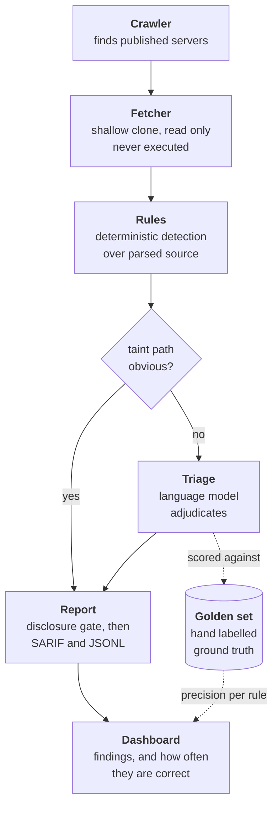

# MCP Security Observatory


**A public risk index for MCP servers, published with an honest measure of how
often it is wrong.**

AI assistants load plugins called MCP servers. They run on your machine, with
your privileges, and most editors start them automatically when you open a
project. There is no sandbox and no review. This reads them without running a
single line of them.

> **Pre-launch.** Being built in the open. No ecosystem-wide numbers are
> published yet, and this page will not claim any until they exist. What *has*
> been measured is below, with its limits stated.

---

## Contents

- [🧭 Who this is for](#-who-this-is-for)
- [🎯 The problem](#-the-problem)
- [🔍 What this does](#-what-this-does)
- [📊 What has actually been measured](#-what-has-actually-been-measured)
- [⭐ What is different about this one](#-what-is-different-about-this-one)
- [🏗️ How it works](#-how-it-works)
- [⚡ Running it](#-running-it)
- [🗺️ Where it stands](#-where-it-stands)
- [📁 Repository layout](#-repository-layout)
- [🛡️ Principles](#-principles)

---

## 🧭 Who this is for

| You are | What you get |
| --- | --- |
| **A developer installing MCP servers** | A way to check whether a plugin you are about to give filesystem and shell access is safe, and how much to trust that answer. |
| **An MCP server maintainer** | Findings about your own server, sent to you privately before they are published anywhere. |
| **A security researcher** | An open, randomly sampled, hand-labelled benchmark of real findings, plus a scoring script, so any scanner can be measured on the same footing. |
| **Anyone curious how this is built** | An engineering log of every decision and what it cost, and a methodology page where every published number shows its working. |

You do **not** need to know what MCP is to read the next section.

---

## 🎯 The problem

A plugin describes its own tools in plain English, and the assistant acts on
those descriptions. That turns a description into an instruction channel
pointed straight at the model. Text hidden inside it can tell the assistant to
do something you never asked for, and you never see it.

Published research found critical flaws in roughly a third of the servers it
examined, and path-traversal bugs in 82% of those that touch files.

Checking a plugin means reading the source of untrusted software — software you
must **never run** in order to inspect it.

And the ecosystem is bigger than anyone says. Published counts disagree by a
factor of eight, because a registry entry is a *registered name*, not a server.
A crawl on 2026-09-21 found:

```
34,630  registry entries
 8,004  no source to read       (hosted services)
 5,270  duplicates of a repository already counted
21,356  distinct repositories   <- what we actually scan
```

One account alone holds **2,332 registered names pointing at a single
repository**. And a search of GitHub found **13,291 more servers registered
nowhere at all**.

<sub>Full working: [docs/methodology.md](docs/methodology.md) · regenerated
counts: [docs/coverage.md](docs/coverage.md)</sub>

---

## 🔍 What this does

It reads published MCP servers **without executing a single line of them**.

Five rules look for the specific ways these plugins go wrong:

| Rule | Looks for | Built |
| --- | --- | :---: |
| `UNICODE-CONCEAL` | Characters hidden from human eyes | ✅ |
| `SHELL-EXEC-UNSAFE` | Tool input reaching a command interpreter | ✅ |
| `PATH-TRAVERSAL` | Tool input reaching the filesystem unchecked | ✅ |
| `TOOL-DESC-INJECTION` | Instructions smuggled into tool descriptions | ⏳ |
| `SCOPE-OVERBROAD` | Permissions far wider than the plugin needs | ⏳ |

Clear-cut cases are decided by code alone and never cost anything. The
genuinely ambiguous ones go to a judgement model, and **every one of those
judgements is scored against a hand-labelled answer key.**

Anything a plugin ships that its users never run — tests, build scripts,
examples — is not scanned at all, because a flaw there is not a flaw an
assistant can reach. That single decision removed nearly half the findings on a
trial run.

> **Which servers get which checks.** The hidden-character rule reads every
> server, because it needs no parser. The deeper rules read code, and today
> they cover **TypeScript and JavaScript** — measured at 50% of both the
> registry and the unregistered population, against Python's 26–38%. Python
> servers get the character check now and the deeper rules next. **A figure
> from one language is never presented as an ecosystem-wide one.**

---

## 📊 What has actually been measured

A pilot on 2026-09-22: **43 real findings from 10 real servers**, each labelled
by hand by reading the code.

| | precision | recall |
| --- | ---: | ---: |
| Every finding the rules report | **0.81** | **1.00** |
| Only findings the rules call high confidence | 0.62 | 0.14 |
| A calibrated judgement above 0.5 | 0.89 | 0.94 |

**This is a pilot, not the accuracy figure this project exists to publish.**
The sample is concentrated (22 of 43 findings come from one repository), and
the same project wrote both the rules and the labels — which is exactly the
weakness we criticise in figures published elsewhere.

**The most useful result was about us.** Our own "high confidence" flag scored
*worse* than reporting everything. It means "the taint path is unambiguous",
which turns out not to predict whether anything is exploitable. That assumption
shaped two rules and survived only because nothing had ever scored it.

<sub>Method, caveats and what changed as a result:
[docs/methodology.md](docs/methodology.md)</sub>

---

## ⭐ What is different about this one

Other MCP scanners exist, and some are good. Four things are missing from the
field.

**📐 Accuracy measured on a random sample.** Where scanners report accuracy at
all, it is usually against examples the authors chose themselves — which mostly
shows whether the rules match the cases they were written from. Expect a figure
well below perfect here. A perfect score is usually a sign the measurement was
circular.

**📈 A trend over time.** Existing tools give a snapshot. Nobody can currently
answer whether this ecosystem is getting safer. This runs nightly and keeps the
history.

**🔒 Disclosure before publication.** Serious findings are withheld and sent
privately to the maintainer first — enforced in code, not promised in a policy
document.

**💰 A published cost per server.** Most checks never call a model. "It's
cheap" is an adjective; a number you can check is not.

The labelled corpus ships as an **open benchmark with a scoring script**, so
any scanner can be measured on the same footing rather than quoting a number
from its own private collection. A result showing the ecosystem is healthier
than reported is just as publishable as an alarming one.

---

## 🏗️ How it works



Each stage writes a file, so any stage can be run, tested and replaced on its
own. The scoring loop on the right produces the published accuracy figure, and
it gates every pull request.

---

## ⚡ Running it

**Requires Python 3.11+.**

```bash
python3.12 -m venv .venv && source .venv/bin/activate
pip install -e ".[dev]"
```

**Scan one server:**

```bash
mcp-observatory scan --repo-url https://github.com/owner/repo --server-id owner/repo
```

**See what there is to scan** (~90 seconds, no token needed, so anyone can
reproduce the published figure):

```bash
mcp-observatory crawl
```

**Also find servers registered nowhere** (~20 minutes; code search allows ten
requests a minute):

```bash
GITHUB_TOKEN=... mcp-observatory crawl --with-code-search
```

The token is read from the environment rather than a flag, so it stays out of
your shell history.

**Checks:**

```bash
pytest -v        # 265 tests
ruff check .     # lint
mypy             # types
```

---

## 🗺️ Where it stands

| Stage | Status |
| --- | --- |
| Analyzer core, fetcher, rule contract, CI | ✅ Done |
| Registry crawler + coverage reporting | ✅ Done |
| Discovery of unregistered servers | ✅ Done |
| Scan orchestrator, 35,050 repos in ~2 hours | ✅ Done |
| Detection rules | 🔨 3 of 5 |
| SARIF output, disclosure gate, nightly pipeline | ⏳ Next |
| Model adjudication + published accuracy | ⏳ Planned |
| Public dashboard | ⏳ Planned |

---

## 📁 Repository layout

| Path | Purpose |
|---|---|
| `analyzer/crawler/` | Reads the registry, collapses entries to repositories, records coverage |
| `analyzer/fetcher/` | Shallow-clones a server at a pinned commit, read only |
| `analyzer/rules/` | Deterministic detection rules, tree-sitter based |
| `analyzer/triage/` | Model adjudication of ambiguous findings, content-hash cached |
| `analyzer/report/` | Disclosure gate, SARIF and JSONL output |
| `evals/golden/` | Hand-labelled findings used to measure the triage layer |
| `evals/harness/` | Precision, recall and F1 measurement, runs in CI |
| `fixtures/` | Deliberately vulnerable and known-clean servers for rule tests |
| `data/` | Committed scan artifacts. Git history provides the time series |
| `web/` | Static dashboard |

---

## 🛡️ Principles

- **Never execute a scanned server.** The fetcher may invoke `git` and nothing
  else. A test enforces this, not a convention.
- **Publish the error rate.** Per-rule precision ships next to the findings.
- **Disclose before publishing.** Serious findings are withheld pending a
  private disclosure window, enforced in code.
- **No exploit code, ever.**

---

📖 [`docs/methodology.md`](docs/methodology.md) — how every number was produced
🔐 [`SECURITY.md`](SECURITY.md) — disclosure policy
🧾 [`DECISIONS.md`](DECISIONS.md) — engineering log, every decision and what it cost
📐 [`docs/specs/`](docs/specs/) — the design
